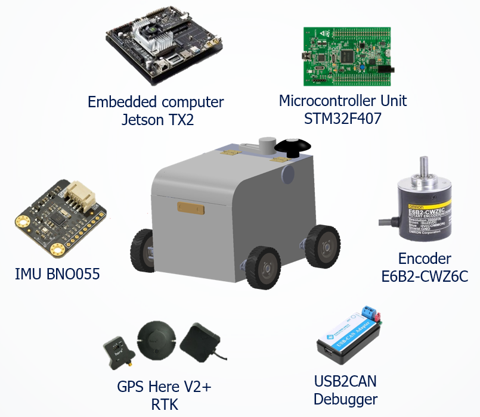
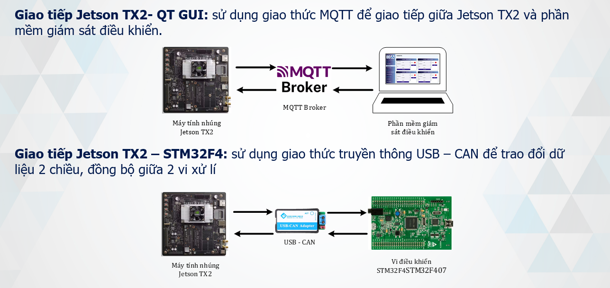
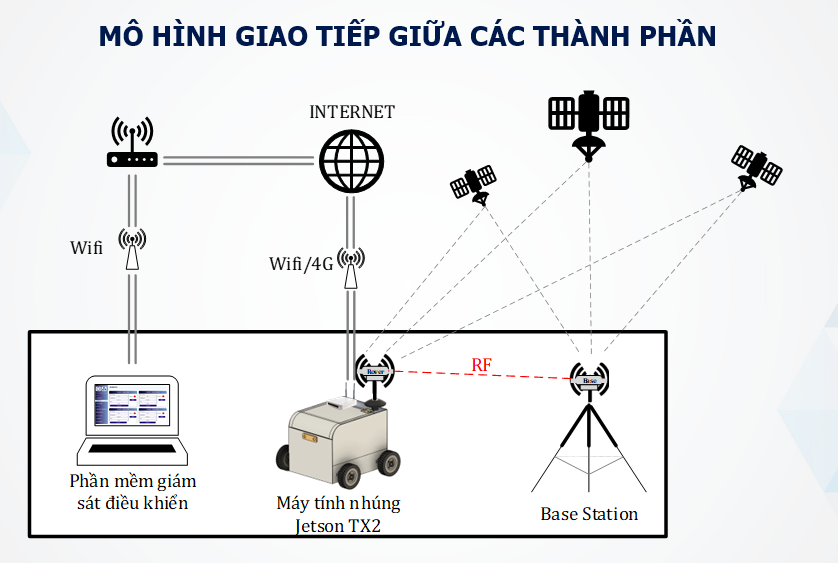

# autonomous-delivery-robot
GPS + IMU outdoor navigation for wheeled robot using LOS Guidance and PID Heading Controller (Jetson TX2 + STM32 + ROS)
---

## 🧠 Key Features

- ✅ **Line-of-Sight (LOS)** guidance algorithm with cross-track/along-track error
- ✅ **Heading controller (PID)** with real-time tuning via `dynamic_reconfigure`
- ✅ **Sensor fusion** from:
  - GPS RTK (Here+ v2)
  - IMU BNO055
  - Wheel encoders
- ✅ **CAN communication** (UART-CAN) to STM32F4 motor board
- ✅ Full **data logging** for performance evaluation (CTE, heading error, wheel speed...)
---

## 🧱 Hardware Architecture

<p align="center">
  
</p>

System includes:
- Jetson TX2 as embedded controller (runs ROS)
- STM32F407 for low-level motor control
- BNO055 IMU, GPS Here+ V2 RTK, E6B2 Encoder
- CAN bus communication via USB2CAN adapter
## 🔄 Internal Communication

<p align="center">
  
</p>

- Jetson TX2 ↔ STM32F4: UART → USB-CAN → STM32 (real-time wheel feedback + motor commands)
- Jetson TX2 ↔ GUI (Qt): via MQTT broker for monitoring + command interface
## 🌐 Full System Integration

<p align="center">
  
</p>

The robot receives RTK GPS corrections via RF from a local base station.  
GUI software communicates via MQTT over WiFi/4G to monitor and control the robot in real-time.
---

## 🛠 How to Run

```bash
cd mybot_ws
catkin_make  --pkg utils
catkin_make
source devel/setup.bash
./run_master.sh
